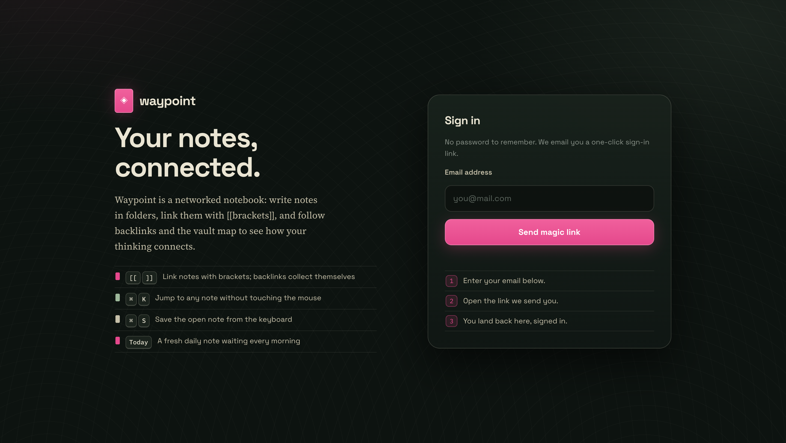
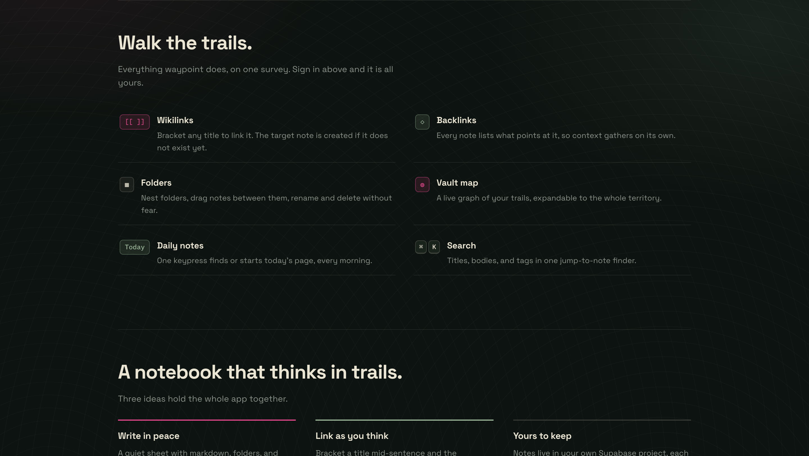
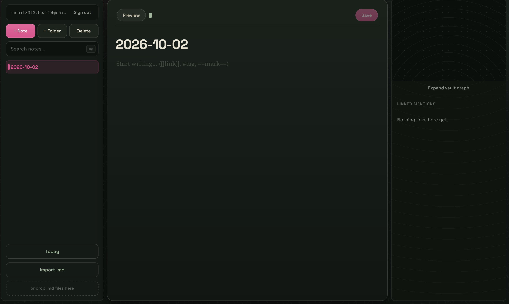
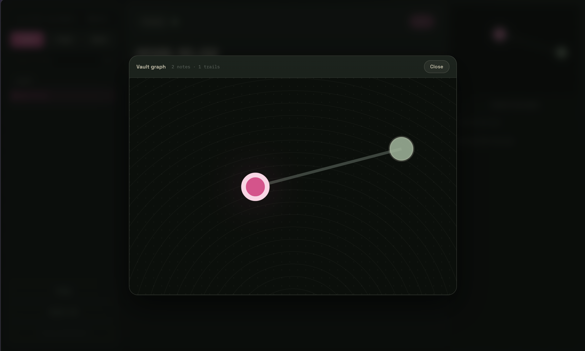
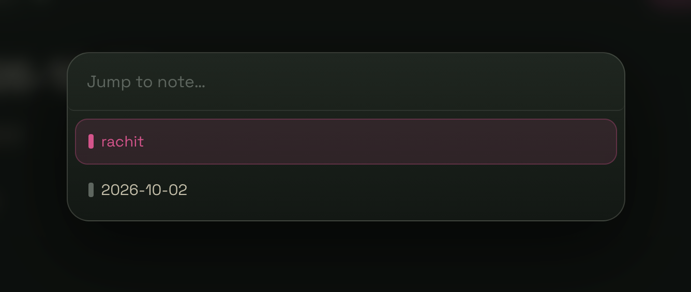
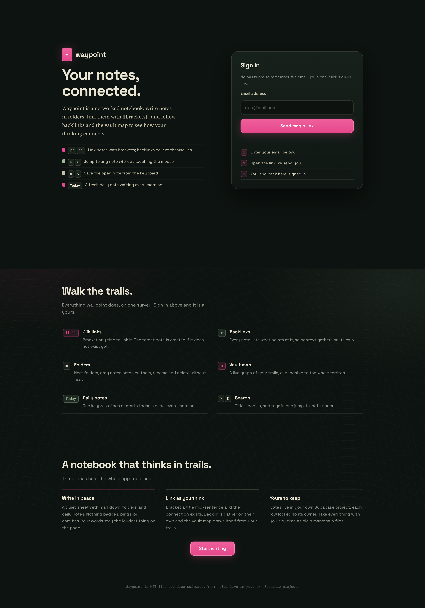

# waypoint

Your notes, connected.

Waypoint is a networked notebook for the web: write notes in folders, link them with
`[[brackets]]`, and follow backlinks and the vault map to see how your thinking connects.
Think Obsidian, but it runs in a browser tab and syncs through Supabase.

No build step, no framework. Plain ES modules, one CSS file per concern, and `marked`
from a CDN for markdown.

## Project showcase

| Landing page | Trail tour |
| --- | --- |
|  |  |

| App dashboard | Vault graph overlay |
| --- | --- |
|  |  |

| Quick search palette | Full landing page |
| --- | --- |
|  |  |

## Features

- **Notes** — create, edit, delete, with an explicit save (Cmd/Ctrl+S) and an unsaved-changes guard. Ordered lists auto-number on Enter; empty items exit the list.
- **Markdown** — CommonMark + GFM via `marked`, headings at every level, `#tag` pills, `==highlights==`, and `> [!note]` callouts rendered on top.
- **Checklists** — `- [ ]` tasks continue on Enter, `[]` plus space becomes a task, and preview checkboxes toggle the note itself when clicked.
- **Wikilinks** — `[[Some Note]]` renders as a link; clicking it opens that note, creating a stub if it doesn't exist yet. Links are stored in a `note_links` table on save.
- **Backlinks** — the right panel lists everything that links to the note you're reading.
- **Folders** — nested tree in the sidebar, drag notes between folders, rename and delete.
- **Daily notes** — one "Today" button finds or creates today's note.
- **Import** — drop a pile of `.md` files in and the batch importer wires up the links between them.
- **Graph** — a force-directed mini map of the current note's neighborhood, expandable to the whole vault.
- **Search and palette** — the sidebar filters titles, bodies, and tags; Cmd/Ctrl+K jumps to any note.
- **Landing page** — a scrollable intro (story, trail tour, principles) with passwordless sign-in built in.
- **Responsive** — below 900px the panes become slide-in drawers behind a top bar.

## Setup

### 1. Create the database

Create a project at [supabase.com](https://supabase.com), then run `schema.sql` from this repo
in the dashboard's SQL Editor. It creates the `notes`, `folders`, and `note_links` tables with
row-level security locking every row to its owner.

### 2. Configure your keys

`js/supabase/config.js` holds your project URL and anon key (Supabase dashboard → Settings → API).
Update it with your own values. The anon key is safe to ship — RLS does the actual guarding.

For a quick throwaway session you can also set `sb_url` and `sb_key` in localStorage; they
override the config file.

### 3. Enable magic links

Authentication is passwordless. In Supabase → Authentication → Providers, enable Email and turn
**off** "Confirm email" if you want one-click logins during development.

Note: Supabase's built-in email service allows about 2 login emails per hour per project, plus
one resend per minute per address. For regular use, add a custom SMTP sender under
Supabase → Authentication → Settings.

## Run it

Any static file server works:

```sh
python3 -m http.server 8000
# then open http://localhost:8000
```

## Deploy

The whole app is static — hand any host the folder and you're done.

- **Netlify** — drag the folder onto [app.netlify.com/drop](https://app.netlify.com/drop), or `netlify deploy` from the CLI.
- **Vercel** — `vercel` in this directory; it detects zero-config static output.
- **GitHub Pages** — push the repo, point Pages at the branch root.

`config.js` is force-tracked in git so deploys include it. If you'd rather keep keys out of version
control, have your host inject `window.WAYPOINT_CONFIG` another way, such as keeping the values
in the host's environment settings and templating them at build.

## Project layout

```
waypoint/
├── index.html
├── schema.sql
├── screenshots/          showcase images used by this README
├── css/
│   ├── tokens.css          design tokens (colors, fonts)
│   ├── base.css            reset, transitions, landing page
│   ├── layout.css          the three-pane grid + drawer behavior
│   └── components/         sidebar, editor, graph, modals
└── js/
    ├── main.js             state, wiring, all the glue
    ├── supabase/           client, auth, and one module per table
    ├── editor/             editor shell + markdown pipeline
    ├── sidebar/            notes bar, folder tree, search, backlinks, palette
    ├── graph/              simulation, SVG renderer, full-vault overlay
    ├── daily/              daily notes
    ├── import/             .md batch importer
    └── utils/              tiny DOM helpers
```

## License

MIT — see [LICENSE](LICENSE).
